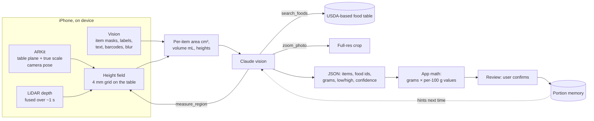

# Looseweight — build spec

> Goal (owner's words): *"an app that will enable users to lose weight by just logging the calories accurately by camera (very accurately). The app UI is iOS Liquid Glass."*

## 1. What the user does

| Step | Screen | What happens |
|---|---|---|
| 1 | Onboarding | Sex, age, height, weight, goal weight, activity, pace → daily calorie target |
| 2 | Today | Calorie ring (left today), protein / carbs / fat, meals of the day |
| 3 | Scan | Camera. Hold the phone flat over the plate. LiDAR depth is captured with the photo when the phone has it |
| 4 | Analyzing | Claude finds every food, measures each one with the depth map, matches it to the nutrition database |
| 5 | Review | Each item with grams, range and confidence. One tap to change grams. Save |
| 6 | Progress | Weight log, trend line, real daily burn (learned from your data), goal date |

Barcode and manual search cover packaged food and home cooking with a kitchen scale.

## 2. How the accuracy works

Calories = **grams** × **calories per gram**. Both halves are grounded, not guessed.
The iPhone measures on the device; the AI names the food and does the judgment.

**On the iPhone (free, instant, private)**

| Power | Devices | Output |
|---|---|---|
| ARKit world tracking + horizontal plane | every supported iPhone | table plane, camera pose, cm-per-pixel at the plate, plate diameter, item footprint area (cm²) |
| LiDAR scene depth, fused over several frames | Pro iPhones | height field above the table → item volume (mL), heights, plate floor |
| Vision foreground instance masks | all | separate objects (plate, bowl, cup, items) as numbered regions |
| Vision image classification | all | quick food label hints |
| Vision text recognition | all | nutrition labels and packaging text, read exactly |
| Vision barcodes → Open Food Facts | all | exact per-100 g for packaged food |
| Blur, tilt, distance, steadiness checks | all | retake prompts and a live bubble level before the shot |

**In the cloud (Claude, newest Opus model resolved at runtime from `/v1/models`)**

1. Sees the upright photo, a numbered overlay of the on-device regions with a 5 cm scale bar, and the on-device measurement report.
2. Names every item and calls `search_foods` to pick a database id. Nutrients come from the database. If nothing fits, its own per-100 g estimate is used and flagged "AI estimate". Merged database rows carry an energy range; the model may choose inside it, never outside.
3. Turns measured volume into grams with food density (or measured area × estimated thickness without LiDAR; scale cues and counting without ARKit). Calls `measure_region` with its own polygon when an item is not a separate on-device region.
4. Adds hidden calories as their own items: oil, butter, dressings, sauces.
5. Calls `zoom_photo` for a full-resolution crop when detail is unclear.
6. The app re-checks the arithmetic (volume × density) and the database match.

**Then the user** sees grams with a low–high range and can adjust. Corrections become portion memory and are sent as hints next time.

## 3. Weight-loss engine

- BMR: Mifflin–St Jeor. TDEE = BMR × activity factor.
- Target = TDEE − pace × 7,700 kcal/kg ÷ 7. Floors: 1,200 kcal (female) / 1,500 kcal (male). Pace capped at 1 % body weight per week. Goal weight below BMI 18.5 is refused.
- Weight trend: exponential moving average (α = 0.1 per day, gap-aware).
- Adaptive TDEE (after ≥ 14 days, ≥ 10 logged days): intake − trend slope × 7,700. Blended with the formula as data grows.
- Protein target 1.6 g/kg; fat 30 % of energy; carbs the rest.

## 4. Parts

| Part | Path | Tech | Tested by |
|---|---|---|---|
| Core engine | `Packages/LooseweightKit` | Swift 6, Foundation only (runs on iOS, macOS, Linux) | `swift test` on Linux + macOS CI |
| iPhone app | `App/` | SwiftUI iOS 26 (Liquid Glass), SwiftData, ARKit + LiDAR, Vision, VisionKit, Swift Charts | Xcode unit + UI tests on iOS Simulator in CI, screenshots |
| API proxy | `proxy/` | Cloudflare Worker (TypeScript) | vitest |
| Accuracy eval | `Packages/LooseweightKit/Sources/lw-eval` | Swift CLI on Nutrition5k (real dishes with weighed calories + depth) | runs when an API key is present |
| CI | `.github/workflows/ci.yml` | GitHub Actions (Linux + macOS runners) | — |

## 5. AI connection modes (Settings)

| Mode | For | Key location |
|---|---|---|
| Looseweight Cloud (proxy) | Production | Server secret in the Worker; app sends an app token |
| My Anthropic key | Personal / testing | iOS Keychain on the device |
| Demo | Simulator, UI tests, first look | No network; canned result for the bundled sample |

## 6. Claude request contract

- `POST /v1/messages`, non-streaming, `max_tokens` 16,000, adaptive thinking (model default), `output_config.effort` = `high` (Precise) or `medium` (Fast), `output_config.format` = analysis JSON schema, `fallbacks: "default"` (beta `server-side-fallback-2026-07-01`) so a false-positive refusal is retried on the recommended model.
- Tools: `search_foods` (always), `measure_region` (only with depth), `zoom_photo` (only with a full-res original). `tool_choice` auto. Loop ≤ 6 turns.
- Append-only history; assistant content is echoed back byte-for-byte. System prompt + tools are cached (`cache_control`).
- `stop_reason == "refusal"` → friendly error, no partial result.

## 7. Evidence so far

| Check | Result |
|---|---|
| Synthetic scenes (exact ray-cast depth, like LiDAR) | volume error ≤ 6 % in one frame, ≤ 8 % fused from 12 noisy frames; plate floor found within 2.5 mm; true area without LiDAR within 10 % |
| Real depth-camera plates (Nutrition5k, 26 overhead shots, crude colour mask) | plausible volumes, median 0.57 g/mL; volume alone correlates r = 0.50 with weighed mass because food densities differ (salad ≈ 0.1, meat ≈ 1.0) — the model supplies density per food |
| Full AI accuracy (`lw-eval ai --compare`) | needs an API key; reports calorie error with and without on-device measurements |

## 8. Privacy & safety

- Photos go only to the chosen AI connection. Data stays on the phone (SwiftData). Export and delete-all in Settings.
- Not medical advice. Targets never go below the floors in §3.

## 9. Out of scope for v1

App Store release, accounts/sync, HealthKit sync, Apple Watch, widgets, Arabic UI.
